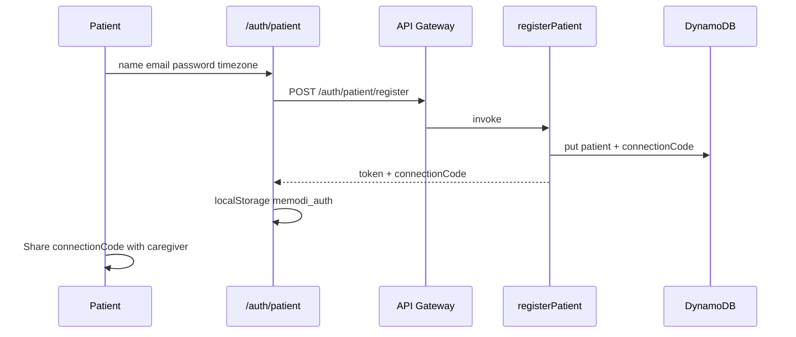
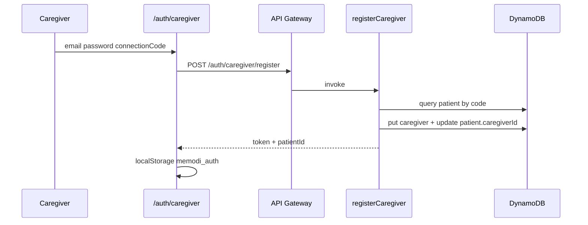

# Auth and Sessions

Memodi uses email/password accounts for patients and caregivers, JWT session tokens, and an 8-character **connection code** so caregivers link to a patient.

Decisions: [OPEN_QUESTIONS.md](../decisions/OPEN_QUESTIONS.md) (all resolved).

## Roles

| Role | Account table | UI routes |
|------|---------------|-----------|
| `patient` | `memodi-patients` | `/patient` only |
| `caregiver` | `memodi-caregivers` | `/family`, `/caregiver` |

**Future:** A separate “family member” role may access Memory Bank without full caregiver dashboard. Not in v1.

Patients **cannot** access `/family` or `/caregiver`. Caregivers **cannot** access `/patient`.

## Patient registration

**Endpoint:** `POST /auth/patient/register`

**Required body:** `email`, `password`, `name`, `timezone`

**Optional body:** `dateOfBirth` (profile later if omitted)

**Not collected at signup:** preferences (defaults applied server-side), DOB (optional)

**Server actions:**

1. Reject if email exists (`EmailIndex`)
2. Hash password (bcrypt, cost 10)
3. Generate `patientId` = `patient-{uuid}`
4. Generate `connectionCode` (8 chars)
5. Write patient with empty memory lists and default `preferences`
6. Sign JWT: `{ sub, role: "patient", patientId }`, 30-day expiry

**Response:** `{ token, connectionCode, patientId, role, name }`

Patient shares `connectionCode` with caregiver out of band.

## Patient login

**Endpoint:** `POST /auth/patient/login`

**Body:** `email`, `password`

**Response:** `{ token, patientId, role: "patient", name }`

## Caregiver registration

**Endpoint:** `POST /auth/caregiver/register`

**Required body:** `email`, `password`, `connectionCode` (no signup without code)

**Server actions:**

1. Reject duplicate caregiver email
2. Lookup patient by `connectionCode` (uppercase trimmed)
3. 404 if invalid
4. Create caregiver with `linkedPatientId`
5. Set `patient.caregiverId` (one caregiver per patient; overwrites if re-linked)
6. Sign JWT: `{ sub, role: "caregiver", caregiverId, patientId }`

**Response:** `{ token, caregiverId, patientId, patientName, role: "caregiver" }`

## Caregiver login

**Endpoint:** `POST /auth/caregiver/login`

**Response:** `{ token, caregiverId, patientId, role: "caregiver" }`

## JWT

| Property | Value |
|----------|-------|
| Secret | `JWT_SECRET` env var |
| Expiry | 30 days |
| Header | `Authorization: Bearer <token>` |

### Claims

**Patient:** `{ sub: patientId, role: "patient", patientId }`

**Caregiver:** `{ sub: caregiverId, role: "caregiver", caregiverId, patientId: linkedPatientId }`

## Frontend session

**Storage:** `localStorage.memodi_auth`

```json
{
  "token": "<jwt>",
  "role": "patient" | "caregiver",
  "patientId": "<id>",
  "caregiverId": "<id if caregiver>",
  "name": "<string>",
  "connectionCode": "<patient register only>"
}
```

**Provider:** `web/lib/auth.js` — `AuthProvider`, `useAuth()`, `login()`, `logout()`

**API client:** `web/lib/api.js` attaches Bearer token on core routes.

## Route protection (frontend)

Implement via Next.js `middleware.js` and/or layout guards.

| Route | Allowed roles |
|-------|---------------|
| `/auth/patient` | Unauthenticated (redirect if logged in) |
| `/auth/caregiver` | Unauthenticated |
| `/patient` | `patient` |
| `/family` | `caregiver` only |
| `/caregiver` | `caregiver` |

`TabNav.jsx` already shows role-specific tabs and hides when logged out.

## API authorization (backend)

**v1 decision:** **Client-only.** Lambdas do **not** verify JWT. Any caller who knows a `patientId` can hit APIs. Document as known limitation; add `lambda/shared/auth.js` post-hackathon.

Frontend should still send `Authorization: Bearer` so backend enforcement can be added without client changes.

## Connection code

| Topic | v1 behavior |
|-------|-------------|
| Caregivers per patient | One (`caregiverId` on patient) |
| Code rotation | Not supported |
| Multiple caregivers | Post-hackathon |

## Flow diagrams

### Patient onboarding



### Caregiver linking



## Related docs

- [data-model.md](data-model.md)
- [for-agents/api-reference.md](../for-agents/api-reference.md)
- [for-humans/user-journeys.md](../for-humans/user-journeys.md)
