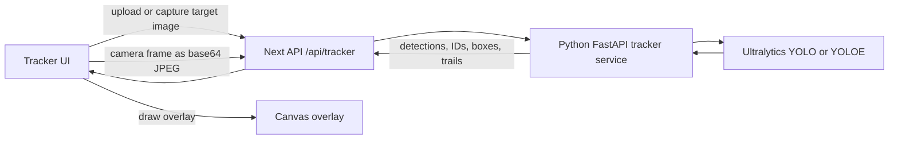

# Photo-to-Real-Time Object Tracker

Memodi can include a separate object-finding tool where a person takes or uploads a picture of an item, then scans the room with a live camera feed while the system tracks visually matching objects.

The goal is simple: a caregiver or patient shows the system what to find, such as a phone, bag, remote, bottle, or keys, and the tool highlights likely matches in real time.

> This tracker is a prototype assistive feature. It should help locate objects, but it should not be treated as a safety-critical locator.

## Concept

```text
User takes or uploads a target picture
        ↓
Ultralytics model identifies or embeds the target
        ↓
Live camera feed starts
        ↓
YOLO detection/tracking runs frame by frame
        ↓
The app draws boxes, IDs, confidence, movement direction, and trails
```

There are two useful implementation modes:

1. **Class-based tracking:** detect the object class in the photo, then track every live object of that class.
2. **Reference-image tracking:** use the uploaded picture itself as a visual prompt and track objects that look like the reference.

Class-based tracking is faster and easier, but only works for known YOLO classes. Reference-image tracking is better for specific items, but may be heavier and less predictable on CPU.

## Recommended Approach For Memodi

Use a two-layer strategy:

| Layer | Purpose | Model family |
|-------|---------|--------------|
| Fast fallback | Track common object classes like person, phone, bottle, remote, chair, laptop | `YOLO("yolo11n.pt")` or similar |
| Specific object mode | Track an item from a reference image when the class is unknown or too broad | `YOLOE` visual prompting |

This matters because many useful household objects are not in the standard COCO class list. For example, standard YOLO can detect `cell phone` and `remote`, but not usually `keys`, `wallet`, `AirPods`, or `charger`.

## User Experience

The intended flow:

1. User opens the object tracker page.
2. User chooses an object label, such as `phone`, `keys`, or `wallet`.
3. User either uploads a picture or uses the camera to take a target photo.
4. The system loads that picture as the tracking target.
5. User starts live tracking.
6. The app shows:
   - live camera preview
   - bounding box around the detected object
   - track ID
   - confidence score
   - center point
   - movement direction
   - recent movement trail

Good target photos should be:

- close to the object
- well lit
- not blurry
- mostly filled by the object
- taken from a similar angle to how the object will appear in the live feed

## Architecture



The browser owns the camera preview and overlay drawing. The Python service owns the model and tracking state.

## API Shape

The tracker should expose three local endpoints.

### `GET /health`

Reports whether the local tracker service is available.

Example response:

```json
{
  "status": "ok",
  "engine": "ultralytics",
  "model": "yoloe-26s-seg.pt",
  "ultralytics": "8.4.51",
  "targetReady": false
}
```

### `POST /targets`

Accepts one or more target images. The first version can store the target in memory for the current local session.

Example request:

```json
{
  "targets": [
    {
      "name": "phone",
      "imageBase64": "<jpeg base64>"
    }
  ]
}
```

Example response:

```json
{
  "status": "ok",
  "targetReady": true,
  "targetName": "phone",
  "referenceCount": 1,
  "referenceSize": {
    "width": 640,
    "height": 480
  }
}
```

### `POST /track`

Accepts a live camera frame and returns object locations.

Example request:

```json
{
  "imageBase64": "<jpeg base64>"
}
```

Example response:

```json
{
  "status": "ok",
  "frame": {
    "width": 960,
    "height": 720
  },
  "targetName": "phone",
  "tracked": true,
  "detections": [
    {
      "id": 1,
      "label": "phone",
      "confidence": 0.81,
      "box": [120.4, 88.2, 260.1, 330.9],
      "center": {
        "x": 190.25,
        "y": 209.55
      },
      "velocity": {
        "x": 4.1,
        "y": -1.3
      },
      "direction": "right",
      "trail": [
        { "x": 180.2, "y": 211.0 },
        { "x": 185.9, "y": 210.1 },
        { "x": 190.25, "y": 209.55 }
      ]
    }
  ]
}
```

## Project Structure

Recommended structure for the local Python service:

```text
services/object-tracker/
├── server.py              # FastAPI service
├── requirements.txt       # Python dependencies
└── .venv/                 # Local virtualenv, ignored by git

scripts/
├── setup-tracker.sh       # Creates venv and installs dependencies
└── start-tracker.sh       # Starts uvicorn on 127.0.0.1:59127

web/app/api/tracker/
├── health/route.js        # Next proxy to local service
├── targets/route.js       # Target image upload proxy
└── track/route.js         # Live frame tracking proxy

web/app/tracker/
└── page.js                # Browser UI: upload/capture, camera, canvas overlay
```

## Requirements

| Requirement | Recommended |
|-------------|-------------|
| Python | 3.10+ |
| `ultralytics` | 8.3+ |
| OpenCV | 4.8+ |
| NumPy | 1.24+ |
| Torch | 1.8+ |
| Camera | Browser webcam or device camera |

GPU is optional. CPU can work if frame rate and image size are kept conservative.

## Installation

From the repository root:

```bash
python3 -m venv services/object-tracker/.venv
services/object-tracker/.venv/bin/python -m pip install --upgrade pip
services/object-tracker/.venv/bin/pip install ultralytics opencv-python numpy fastapi "uvicorn[standard]"
```

Or use a setup script:

```bash
npm run tracker:setup
```

Start the tracker service:

```bash
npm run tracker:up
```

Expected local service:

```text
http://127.0.0.1:59127
```

Expected app route:

```text
http://localhost:3000/tracker
```

## Core Concepts

### Detection

Detection finds objects in a single image or frame.

```python
from ultralytics import YOLO

model = YOLO("yolo11n.pt")
results = model.predict("target.jpg", conf=0.4)
```

Detection output includes:

- bounding boxes
- class IDs
- class names
- confidence scores

### Tracking

Tracking follows objects across frames.

```python
results = model.track(frame, persist=True, tracker="bytetrack.yaml")
```

Tracking output adds:

- persistent track IDs
- frame-to-frame continuity
- better live movement behavior

The key setting is:

```python
persist=True
```

Without `persist=True`, the tracker may reset IDs every frame.

### ByteTrack

ByteTrack is a common real-time tracking algorithm supported by Ultralytics.

It:

- assigns IDs to detected objects
- keeps IDs stable across frames
- handles brief occlusion better than detection alone
- is fast enough for webcam workflows

Use:

```python
tracker="bytetrack.yaml"
```

### BoT-SORT

BoT-SORT can be better for re-identification when objects disappear and return.

Use:

```python
tracker="botsort.yaml"
```

It can be more accurate but may be slower.

## Mode 1: Class-Based Tracking

Class-based tracking works like this:

1. Run YOLO detection on the target photo.
2. Pick the largest or highest-confidence detected object.
3. Extract its class ID.
4. Run live tracking filtered to that class.

Example:

```python
from ultralytics import YOLO

model = YOLO("yolo11n.pt")
photo_results = model.predict("photos/target.jpg", conf=0.4, verbose=False)
boxes = photo_results[0].boxes

best_idx = boxes.conf.argmax()
class_id = int(boxes.cls[best_idx])
class_name = model.names[class_id]

live_results = model.track(
    source=frame,
    conf=0.4,
    tracker="bytetrack.yaml",
    persist=True,
    classes=[class_id],
    verbose=False,
)
```

Pros:

- fast
- simple
- works well for known object categories
- reliable for common COCO objects

Cons:

- tracks all objects of that class, not necessarily the exact item
- cannot detect objects outside the model's known classes

Example problem:

If the target photo is one phone and there are three phones in the room, class-based tracking may find all phones.

## Mode 2: Reference-Image Tracking With YOLOE

Reference-image tracking uses the uploaded target picture as a visual prompt.

This is closer to what Memodi wants for specific objects:

```text
Here is this exact thing.
Now find things that look like this in the live feed.
```

Example YOLOE setup:

```python
import numpy as np
from ultralytics import YOLOE
from ultralytics.models.yolo.yoloe import YOLOEVPSegPredictor

model = YOLOE("yoloe-26s-seg.pt")

visual_prompts = {
    "bboxes": np.array([[0, 0, reference_width - 1, reference_height - 1]], dtype=np.float32),
    "cls": np.array([0], dtype=np.int32),
}

model.predict(
    source="reference.jpg",
    refer_image="reference.jpg",
    visual_prompts=visual_prompts,
    predictor=YOLOEVPSegPredictor,
    conf=0.2,
    verbose=False,
)
```

Then live frames can be passed through the model:

```python
results = model.predict(frame, conf=0.2, verbose=False)
```

Pros:

- better for custom objects
- no training required
- can work with objects outside COCO classes

Cons:

- heavier than class-based tracking
- may be slower on CPU
- accuracy depends heavily on the reference photo
- may need confidence tuning

## Photo Capture Flow

The browser can capture a target photo directly from the camera:

```js
const canvas = document.createElement('canvas');
canvas.width = video.videoWidth;
canvas.height = video.videoHeight;
canvas.getContext('2d').drawImage(video, 0, 0, canvas.width, canvas.height);
const imageBase64 = canvas.toDataURL('image/jpeg', 0.72).split(',')[1];
```

Then send it to the backend:

```js
await fetch('/api/tracker/targets', {
  method: 'POST',
  headers: { 'Content-Type': 'application/json' },
  body: JSON.stringify({
    targets: [
      {
        name: 'phone',
        imageBase64,
      },
    ],
  }),
});
```

## Live Tracking Flow

The browser periodically captures frames:

```js
const frame = canvas.toDataURL('image/jpeg', 0.72).split(',')[1];

const response = await fetch('/api/tracker/track', {
  method: 'POST',
  headers: { 'Content-Type': 'application/json' },
  body: JSON.stringify({ imageBase64: frame }),
});

const data = await response.json();
```

Then the frontend draws boxes on a canvas overlay.

Frame rate should start low:

```text
3-5 FPS
```

This keeps CPU load reasonable and avoids browser jank.

## Drawing The Overlay

The frontend should draw:

- bounding rectangle
- target label
- confidence percentage
- track ID
- center dot
- movement vector
- recent trail

Canvas drawing example:

```js
ctx.strokeStyle = '#DC4F7C';
ctx.lineWidth = 4;
ctx.strokeRect(x1, y1, x2 - x1, y2 - y1);

ctx.fillStyle = '#FCE9AB';
ctx.beginPath();
ctx.arc(center.x, center.y, 6, 0, Math.PI * 2);
ctx.fill();
```

Movement direction can be calculated from center deltas:

```python
dx = current_center_x - previous_center_x
dy = current_center_y - previous_center_y
```

Simple direction labels:

- `steady`
- `left`
- `right`
- `up`
- `down`
- `up-left`
- `up-right`
- `down-left`
- `down-right`

## Similarity Matching

For specific object matching, class tracking alone is not enough. Add similarity scoring between the reference crop and each live detection.

Simple option: HSV color histogram.

```python
import cv2
import numpy as np

def compute_color_histogram(image):
    hsv = cv2.cvtColor(image, cv2.COLOR_BGR2HSV)
    hist = cv2.calcHist([hsv], [0, 1], None, [50, 60], [0, 180, 0, 256])
    cv2.normalize(hist, hist)
    return hist.flatten()

def histogram_similarity(hist1, hist2):
    score = cv2.compareHist(
        hist1.reshape(-1, 1).astype(np.float32),
        hist2.reshape(-1, 1).astype(np.float32),
        cv2.HISTCMP_CORREL,
    )
    return max(0.0, score)
```

Better option: visual embeddings from a model designed for image similarity.

Possible future choices:

- CLIP embeddings
- YOLOE visual prompt embeddings
- MobileNet / EfficientNet feature vectors
- custom Siamese network for object re-identification

## Full Local Python Prototype

This is a standalone Python version of the idea. It is useful for testing outside the web app.

### `config.py`

```python
MODEL = "yolo11n.pt"
CAMERA_INDEX = 0
CONFIDENCE = 0.4
TRACKER = "bytetrack.yaml"
PHOTO_PATH = "photos/target.jpg"
SAVE_VIDEO = False
OUTPUT_PATH = "output/tracked.mp4"
```

### `capture_photo.py`

```python
import cv2
import os

def capture_photo(camera_index=0, save_path="photos/target.jpg"):
    os.makedirs(os.path.dirname(save_path), exist_ok=True)
    cap = cv2.VideoCapture(camera_index)
    if not cap.isOpened():
        raise RuntimeError("Could not open webcam.")

    while True:
        ret, frame = cap.read()
        if not ret:
            break

        overlay = frame.copy()
        cv2.putText(
            overlay,
            "Point at object - SPACE to capture, Q to quit",
            (20, 40),
            cv2.FONT_HERSHEY_SIMPLEX,
            0.8,
            (0, 255, 255),
            2,
        )

        h, w = frame.shape[:2]
        cv2.drawMarker(overlay, (w // 2, h // 2), (0, 255, 255), cv2.MARKER_CROSS, 40, 2)
        cv2.imshow("Capture Target Photo", overlay)
        key = cv2.waitKey(1) & 0xFF

        if key == ord(" "):
            cv2.imwrite(save_path, frame)
            break
        if key == ord("q"):
            cap.release()
            cv2.destroyAllWindows()
            return None

    cap.release()
    cv2.destroyAllWindows()
    return save_path
```

### `detect_object.py`

```python
from ultralytics import YOLO

def detect_object_class(image_path, model_path="yolo11n.pt", confidence=0.4):
    model = YOLO(model_path)
    results = model.predict(source=image_path, conf=confidence, verbose=False)
    boxes = results[0].boxes

    if boxes is None or len(boxes) == 0:
        return None, None

    areas = []
    for box in boxes.xyxy:
        x1, y1, x2, y2 = box
        areas.append(float((x2 - x1) * (y2 - y1)))

    best_idx = areas.index(max(areas))
    class_id = int(boxes.cls[best_idx])
    class_name = model.names[class_id]
    return class_name, class_id
```

### `tracker.py`

```python
import cv2
from ultralytics import YOLO

def run_tracker(class_id, class_name, model_path="yolo11n.pt", camera_index=0, confidence=0.4, tracker="bytetrack.yaml"):
    model = YOLO(model_path)
    cap = cv2.VideoCapture(camera_index)
    if not cap.isOpened():
        raise RuntimeError("Could not open webcam.")

    while cap.isOpened():
        ret, frame = cap.read()
        if not ret:
            break

        results = model.track(
            source=frame,
            conf=confidence,
            tracker=tracker,
            persist=True,
            classes=[class_id],
            verbose=False,
        )

        annotated = draw_tracks(frame, results, class_name)
        cv2.imshow("Object Tracker", annotated)

        if cv2.waitKey(1) & 0xFF == ord("q"):
            break

    cap.release()
    cv2.destroyAllWindows()

def draw_tracks(frame, results, class_name):
    annotated = frame.copy()
    boxes = results[0].boxes
    if boxes is None:
        return annotated

    for i, box in enumerate(boxes.xyxy):
        x1, y1, x2, y2 = map(int, box)
        track_id = int(boxes.id[i]) if boxes.id is not None else None
        confidence = float(boxes.conf[i])

        label = f"{class_name}"
        if track_id is not None:
            label += f" #{track_id}"
        label += f" {confidence:.0%}"

        cv2.rectangle(annotated, (x1, y1), (x2, y2), (0, 255, 0), 2)
        cv2.putText(annotated, label, (x1, max(20, y1 - 8)), cv2.FONT_HERSHEY_SIMPLEX, 0.6, (0, 255, 0), 2)

    return annotated
```

### `main.py`

```python
from config import CAMERA_INDEX, CONFIDENCE, MODEL, PHOTO_PATH, TRACKER
from capture_photo import capture_photo
from detect_object import detect_object_class
from tracker import run_tracker

def main():
    photo_path = capture_photo(camera_index=CAMERA_INDEX, save_path=PHOTO_PATH)
    if not photo_path:
        return

    class_name, class_id = detect_object_class(photo_path, model_path=MODEL, confidence=CONFIDENCE)
    if class_name is None:
        print("No object detected. Try a closer, clearer photo.")
        return

    print(f"Tracking: {class_name}")
    run_tracker(class_id, class_name, model_path=MODEL, camera_index=CAMERA_INDEX, confidence=CONFIDENCE, tracker=TRACKER)

if __name__ == "__main__":
    main()
```

## COCO Classes

Standard YOLO models trained on COCO can detect 80 common classes.

Useful Memodi-related examples:

| ID | Class |
|----|-------|
| 0 | person |
| 24 | backpack |
| 26 | handbag |
| 28 | suitcase |
| 39 | bottle |
| 41 | cup |
| 56 | chair |
| 57 | couch |
| 60 | dining table |
| 62 | tv |
| 63 | laptop |
| 64 | mouse |
| 65 | remote |
| 66 | keyboard |
| 67 | cell phone |
| 73 | book |
| 74 | clock |
| 76 | scissors |
| 77 | teddy bear |
| 79 | toothbrush |

Important missing objects:

- keys
- wallet
- AirPods
- charger
- pill bottle as a distinct object
- glasses as a distinct object

For these, use YOLOE visual prompting, YOLO-World text prompts, or a custom fine-tuned detector.

## Model Choices

| Model | Best for | Notes |
|-------|----------|-------|
| `yolo11n.pt` | CPU, fast prototype | Fastest, least accurate |
| `yolo11s.pt` | Laptop default | Good balance |
| `yolo11m.pt` | Better accuracy | Slower on CPU |
| `yolo11l.pt` | High accuracy | GPU recommended |
| `yolo11x.pt` | Maximum accuracy | High-end GPU recommended |
| `yoloe-26s-seg.pt` | Reference-image visual prompting | Better for custom objects, heavier |

Start with `yolo11n.pt` for class-based tracking and `yoloe-26s-seg.pt` for reference-image tracking.

## Performance Tips

### Improve speed

- Use `yolo11n.pt`.
- Resize live frames to 640px or 320px.
- Process every second or third frame.
- Send frames at 3-5 FPS from the browser.
- Keep overlays in the browser, not the Python service.

Example:

```python
results = model.track(frame, imgsz=320, persist=True, tracker="bytetrack.yaml")
```

### Improve accuracy

- Use a larger model.
- Lower confidence threshold from `0.4` to `0.25`.
- Improve lighting.
- Move closer to the object.
- Use multiple reference images.
- Prefer a clean target photo where the object fills the frame.

### Reduce duplicate boxes

Run a simple de-duplication step using IoU:

```python
def keep_non_overlapping(candidates, threshold=0.65):
    kept = []
    for candidate in sorted(candidates, key=lambda item: item["confidence"], reverse=True):
        if all(iou(candidate["box"], existing["box"]) < threshold for existing in kept):
            kept.append(candidate)
    return kept
```

## Troubleshooting

### The upload does nothing

Check:

- browser console for fetch errors
- `GET /api/tracker/health`
- local Python service is running
- file input accepts `image/*`
- request body includes `targets[].imageBase64`

### `Failed to fetch`

This usually means the frontend cannot reach the backend API.

Check:

- `NEXT_PUBLIC_API_BASE_URL`
- local backend/API service is running
- CORS settings
- browser network tab
- whether the request points to `localhost:3001`, deployed API Gateway, or a Next proxy route

For tracker routes, prefer a Next proxy:

```text
/api/tracker/health
/api/tracker/targets
/api/tracker/track
```

### Target loads but nothing is found

Try:

- take a closer target photo
- improve lighting
- hold camera steady
- lower `TRACKER_CONF`
- use multiple target photos
- use YOLOE visual prompting for objects not in COCO
- use class-based tracking for common objects like phone, bottle, laptop, remote

### It tracks the wrong object

This can happen when:

- multiple similar objects are visible
- target photo has too much background
- class-based tracking is being used instead of reference-image tracking
- confidence threshold is too low

Fixes:

- crop closer to the object
- add similarity matching
- raise confidence threshold
- use more than one target image
- add object re-identification embeddings

### FPS is too slow

Try:

- lower frame rate to 3 FPS
- use `imgsz=320`
- use `yolo11n.pt`
- skip frames
- avoid sending full-resolution images from browser to Python

### Track IDs keep changing

Check:

```python
persist=True
```

Also try:

```python
tracker="botsort.yaml"
```

## Advanced Options

### YOLO-World text prompts

YOLO-World can detect open-vocabulary labels without training:

```python
from ultralytics import YOLOWorld

model = YOLOWorld("yolov8s-world.pt")
model.set_classes(["car keys", "wallet", "AirPods", "phone charger"])
results = model.track(source=0, persist=True, conf=0.3)
```

This is useful when the user can name the thing they want to find.

### Fine-tuned detector

For a reliable product, fine-tune a small detector for common assistive-object categories:

- keys
- wallet
- glasses
- pill bottle
- remote
- phone
- charger
- hearing aid case

Training flow:

```bash
from ultralytics import YOLO

model = YOLO("yolo11n.pt")
model.train(data="memodi-objects/data.yaml", epochs=50, imgsz=640)
```

Then run:

```python
model = YOLO("runs/detect/train/weights/best.pt")
```

### Hybrid production strategy

The best long-term system is hybrid:

1. Try custom fine-tuned detector for common Memodi objects.
2. Fall back to YOLOE visual prompt for arbitrary uploaded object photos.
3. Use similarity matching to choose the best instance.
4. Use tracker IDs and trails for stable live UI.

## Privacy Notes

The browser camera feed should not be persisted by default.

Recommended defaults:

- Do not store target photos unless the user explicitly saves them.
- Do not store live frames.
- Keep local service on `127.0.0.1`.
- Use HTTPS in deployed environments for camera permissions.
- Make object tracking separate from patient memory records unless explicitly connected.

## Fit With Memodi

The object tracker should remain a separate tool from the memory companion.

The companion answers questions like:

```text
Where do I usually keep my keys?
```

The tracker answers:

```text
Can I find this specific keychain in the room right now?
```

Together:

1. Memodi memory says keys are usually by the front door.
2. User opens the tracker.
3. User takes or uploads a target picture.
4. Camera scans the room.
5. Tracker highlights likely matches.

This makes the feature useful without confusing the voice companion’s main purpose.

## Useful Links

- [Ultralytics GitHub](https://github.com/ultralytics/ultralytics)
- [Ultralytics Docs](https://docs.ultralytics.com)
- [Ultralytics Tracking Mode](https://docs.ultralytics.com/modes/track)
- [ByteTrack Paper](https://arxiv.org/abs/2110.06864)
- [Roboflow Universe](https://universe.roboflow.com)
