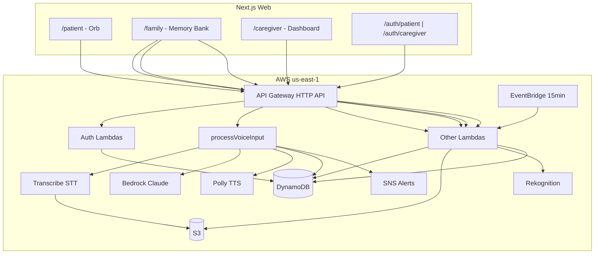

# System Overview

Memodi connects a Next.js web app to AWS Lambda functions behind API Gateway HTTP API. Patients interact via voice; caregivers manage memories and monitor alerts.

## High-level architecture

## Technology stack

| Layer | Choice |
|-------|--------|
| Frontend | Next.js 14, React 18, Tailwind CSS, Axios |
| API | API Gateway HTTP API (v2) |
| Compute | AWS Lambda, Node.js 18, ES modules |
| IaC / deploy | Serverless Framework 3 (`serverless.yml`) |
| Region / stage | `us-east-1`, single stage |
| Primary database | DynamoDB (4 tables) |
| Object storage | S3 (manual setup) |
| LLM | Amazon Bedrock — Claude Sonnet 4 |
| Speech | Polly (Ruth neural), Transcribe (en-US) |
| Vision | Rekognition `memodi-faces` (manual setup) |
| Notifications | SNS |
| Schedules | EventBridge `rate(15 minutes)` |

## HTTP route map

| Method | Path | Lambda | Purpose |
|--------|------|--------|---------|
| POST | `/auth/patient/register` | `registerPatient` | Create patient + connection code |
| POST | `/auth/patient/login` | `loginPatient` | Patient login |
| POST | `/auth/caregiver/register` | `registerCaregiver` | Caregiver signup + link |
| POST | `/auth/caregiver/login` | `loginCaregiver` | Caregiver login |
| POST | `/voice` | `processVoiceInput` | Voice pipeline |
| POST | `/memory` | `uploadMemory` | Append memory |
| POST | `/identify` | `identifyPhoto` | Face match |
| GET | `/patient/{patientId}` | `getPatient` | Patient profile |
| GET | `/alerts/{patientId}` | `getAlerts` | Alerts list |
| POST | `/alerts/{alertId}/resolve` | `resolveAlert` | Resolve alert |
| GET | `/interactions/{patientId}` | `getInteractions` | Interaction log |
| _(schedule)_ | `rate(15 minutes)` | `getScheduledMessage` | Proactive messages |

See [for-agents/api-reference.md](../for-agents/api-reference.md).

## Frontend routes

| Route | Role | Purpose |
|-------|------|---------|
| `/auth/patient` | Public | Patient register / login |
| `/auth/caregiver` | Public | Caregiver register / login |
| `/patient` | Patient | Voice companion |
| `/family` | Caregiver only | Memory bank |
| `/caregiver` | Caregiver | Dashboard |

Future: family-member role may access Memory Bank.

## Cross-cutting concerns

### CORS

All Lambdas: `Access-Control-Allow-Origin: *`, headers include `Authorization`, OPTIONS supported.

### Authentication

| Concern | v1 behavior |
|---------|-------------|
| JWT issued on login/register | Yes |
| JWT verified on APIs | **No** — client route guards only |
| Frontend Bearer header | Yes (future-proof) |
| Session | `localStorage.memodi_auth` |

Post-hackathon: add backend JWT verification ([decisions](../decisions/OPEN_QUESTIONS.md)).

### Timeouts

`processVoiceInput` 90s; `uploadMemory` / `identifyPhoto` 30s; `getScheduledMessage` 60s.

## Related docs

- [data-model.md](data-model.md)
- [auth-and-sessions.md](auth-and-sessions.md)
- [voice-pipeline.md](voice-pipeline.md)
- [aws-infrastructure.md](aws-infrastructure.md)
