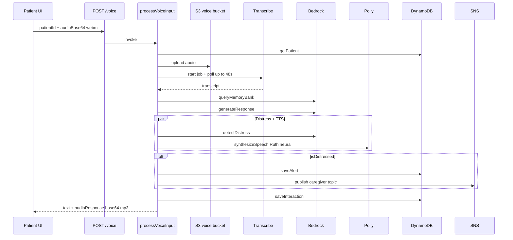

# Voice Pipeline

The core Memodi experience: patient taps the orb, speaks, and receives a warm spoken response grounded in their memory profile. Implemented in `lambda/processVoiceInput/index.js`.

## End-to-end flow



## Request / response

**POST `/voice`**

```json
{ "patientId": "patient-...", "audioBase64": "<webm base64>" }
```

**Success 200:**

```json
{
  "transcribedText": "Where are my glasses?",
  "response": "Your glasses are on the bedside table, Margaret.",
  "audioResponse": "<mp3 base64>",
  "isDistressed": false,
  "distressSeverity": "low"
}
```

**Errors:** 400 (missing fields), 404 (patient not found), 500 (transcription/AI failure)

## Step 1 — Transcription

**Module:** `lambda/shared/transcribe.js`

1. Decode `audioBase64` → buffer
2. `PutObject` to `s3://{S3_VOICE_BUCKET}/transcribe-input/{jobName}.webm`
3. `StartTranscriptionJob` — format `webm`, language `en-US`
4. Poll every 3s, max 16 attempts (~48s)
5. Fetch transcript JSON from S3 result URL

**Job name:** `memodi-{last8ofPatientId}-{timestamp}`

**Failure modes:**

- `FAILED` job status → 500 with Transcribe reason
- Timeout after 48s → 500 `"Transcription timed out"`

## Step 2 — Memory context (Bedrock)

**Function:** `queryMemoryBank(patient, transcribedText)`

Claude analyzes full patient profile + utterance and returns JSON:

```json
{
  "relevantPeople": [],
  "relevantObjects": [],
  "relevantHistory": [],
  "relevantRoutine": null,
  "queryType": "person_inquiry"
}
```

`queryType` enum: `person_inquiry`, `object_location`, `routine`, `general_comfort`, `distress`

Uses `extractJSON()` to parse model output; falls back to empty context on parse failure.

## Step 3 — Response generation (Bedrock)

**Function:** `generateResponse(transcribedText, memoryContext, patient)`

System prompt rules:

- 1–3 short warm sentences
- Never invent facts outside memory context
- Use nickname; respect `preferences.comfortPhrases` and `avoidTopics`
- Gentle handling of deceased persons via `deceasedMessage`
- Warm redirect when unknown

Model: `BEDROCK_MODEL_ID` (default Claude Sonnet 4), max 256 tokens.

## Step 4 — Distress detection (parallel with TTS)

**Function:** `detectDistress(transcribedText)`

Two signals combined (OR):

1. **Keyword list** — e.g. scared, lost, help, where am i, who are you, …
2. **Claude JSON** — `{ isDistressed, severity, reason }` with severity `low` \| `medium` \| `high`

If distressed:

- Create alert in `memodi-alerts` with `caregiverId` from patient record
- Publish SNS to `SNS_CAREGIVER_TOPIC_ARN` with patient name, severity, Memodi response

If `caregiverId` is null (no linked caregiver), alert is still saved; SNS may still fire.

## Step 5 — Text-to-speech

**Module:** `lambda/shared/polly.js`

- Voice: **Ruth**
- Engine: **neural**
- Format: **mp3** → base64 in response

Runs in `Promise.all` with distress detection.

## Step 6 — Persist interaction

**Table:** `memodi-interactions`

| Field | Value |
|-------|-------|
| `type` | `distress` if distressed, else `reactive` |
| `patientSaid` | transcript |
| `memodiResponded` | response text |
| `distressDetected` | boolean |

## Frontend audio capture

**Module:** `web/lib/audio.js`

- `getUserMedia` for microphone
- `MediaRecorder` with `audio/webm;codecs=opus` when supported
- Tap orb: start → tap again: stop → base64 → `sendVoiceInput(patientId, base64)`
- Playback: `data:audio/mpeg;base64,{audioResponse}`

## Proactive messages (related)

**Lambda:** `getScheduledMessage` (EventBridge every 15 minutes)

- Scans all patients
- Compares `routine.schedule[].time` to current local time in patient `timezone` (±7 minutes)
- Generates message + Polly audio, saves `proactive` interaction

Not invoked from patient UI directly; separate from reactive `/voice` flow.

## Performance and cost notes

| Stage | Typical bottleneck |
|-------|-------------------|
| Transcribe | 3–48s polling |
| Bedrock | 2× calls per voice turn (context + response) + 1 if distress AI |
| Polly | Usually sub-second |
| Lambda timeout | 90s configured |

## Related docs

- [system-overview.md](system-overview.md)
- [data-model.md](data-model.md)
- [for-agents/api-reference.md](../for-agents/api-reference.md)
