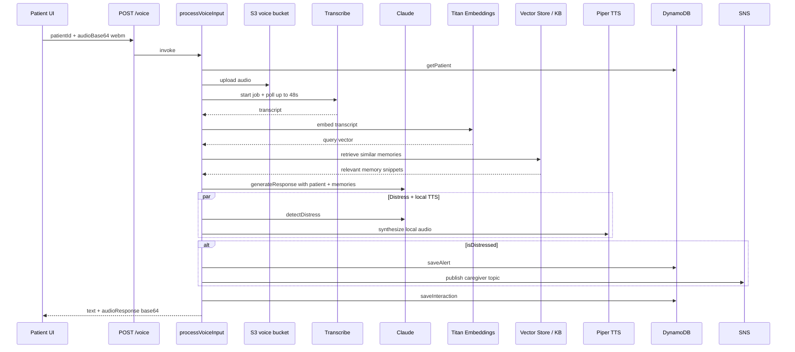

# Voice Pipeline

The core Memodi experience: patient taps the orb, speaks, and receives a warm spoken response grounded in their memory profile. The AI layer produces text; Piper TTS speaks that text locally.

## End-to-end flow



## Request / response

**POST `/voice`**

```json
{ "patientId": "patient-...", "audioBase64": "<webm base64>" }
```

**Success 200:**

```json
{
  "transcribedText": "Where are my glasses?",
  "response": "Your glasses are on the bedside table, Margaret.",
  "audioResponse": "<mp3 base64>",
  "isDistressed": false,
  "distressSeverity": "low"
}
```

**Errors:** 400 (missing fields), 404 (patient not found), 500 (transcription/AI failure)

## Step 1 — Transcription

**Module:** `lambda/shared/transcribe.js`

1. Decode `audioBase64` → buffer
2. `PutObject` to `s3://{S3_VOICE_BUCKET}/transcribe-input/{jobName}.webm`
3. `StartTranscriptionJob` — format `webm`, language `en-US`
4. Poll every 3s, max 16 attempts (~48s)
5. Fetch transcript JSON from S3 result URL

**Job name:** `memodi-{last8ofPatientId}-{timestamp}`

**Failure modes:**

- `FAILED` job status → 500 with Transcribe reason
- Timeout after 48s → 500 `"Transcription timed out"`

## Step 2 — Memory retrieval

Memodi should retrieve memories semantically rather than relying on exact keyword matches.

1. Titan Embeddings converts the transcript into a query vector.
2. The vector store or Bedrock Knowledge Base searches embedded patient memories.
3. The top relevant memories are returned with references to the original DynamoDB records.
4. The response prompt receives only the relevant snippets, not the whole memory bank.

Example:

| Stored memory | Patient query | Match reason |
|---------------|---------------|--------------|
| `Keys are usually kept in the ceramic bowl by the front door.` | `Where are my keys?` | Semantic similarity, not exact wording |

The retrieval layer should return structured context:

```json
{
  "memories": [
    {
      "memoryId": "memory-...",
      "type": "location",
      "text": "Margaret usually leaves her glasses on the nightstand next to her bed or on the kitchen table.",
      "score": 0.87
    }
  ],
  "queryType": "object_location"
}
```

`queryType` enum: `person_inquiry`, `object_location`, `routine`, `general_comfort`, `distress`

## Step 3 — Response generation (Claude via Bedrock)

**Function:** `generateResponse(transcribedText, retrievedMemories, patient)`

System prompt rules:

- 1–3 short warm sentences
- Never invent facts outside retrieved memory context
- Use nickname; respect `preferences.comfortPhrases` and `avoidTopics`
- Gentle handling of deceased persons via `deceasedMessage`
- Warm redirect when unknown

Model: `BEDROCK_MODEL_ID` (default Claude Sonnet 4), max 256 tokens.

## Step 4 — Distress detection (parallel with TTS)

**Function:** `detectDistress(transcribedText)`

Two signals combined (OR):

1. **Keyword list** — e.g. scared, lost, help, where am i, who are you, …
2. **Claude JSON** — `{ isDistressed, severity, reason }` with severity `low` \| `medium` \| `high`

If distressed:

- Create alert in `memodi-alerts` with `caregiverId` from patient record
- Publish SNS to `SNS_CAREGIVER_TOPIC_ARN` with patient name, severity, Memodi response

If `caregiverId` is null (no linked caregiver), alert is still saved; SNS may still fire.

## Step 5 — Local text-to-speech (Piper)

Piper is the voice output layer. It receives the final text response from Claude and converts it into audio for the patient.

What Piper does:

- Receives a plain text string.
- Generates natural-sounding speech.
- Plays audio through the local device or returns audio bytes/base64 to the client.

What Piper does not do:

- It does not reason.
- It does not remember anything.
- It does not choose what to say.
- It does not interact with patient records or vector search.

Piper was chosen because it can run locally, avoids sending voice output generation to a third-party TTS API, and can continue working in low-connectivity environments.

Example local usage:

```bash
echo "Your glasses are on the nightstand." | \
  piper --model en_US-lessac-medium.onnx \
  --output_file response.wav
```

Recommended voice model for the prototype: `en_US-lessac-medium`.

## Step 6 — Persist interaction

**Table:** `memodi-interactions`

| Field | Value |
|-------|-------|
| `type` | `distress` if distressed, else `reactive` |
| `patientSaid` | transcript |
| `memodiResponded` | response text |
| `distressDetected` | boolean |

## Frontend audio capture

**Module:** `web/lib/audio.js`

- `getUserMedia` for microphone
- `MediaRecorder` with `audio/webm;codecs=opus` when supported
- Tap orb: start → tap again: stop → base64 → `sendVoiceInput(patientId, base64)`
- Playback: `data:{mimeType};base64,{audioResponse}`

## Proactive messages (related)

**Lambda:** `getScheduledMessage` (EventBridge every 15 minutes)

- Scans all patients
- Compares `routine.schedule[].time` to current local time in patient `timezone` (±7 minutes)
- Generates message + Piper audio, saves `proactive` interaction

Not invoked from patient UI directly; separate from reactive `/voice` flow.

## Performance and cost notes

| Stage | Typical bottleneck |
|-------|-------------------|
| Transcribe | 3–48s polling |
| Bedrock | Claude response generation + optional distress classification |
| Embeddings | Query vector generation for each memory-aware turn |
| Vector search | Retrieval latency depends on selected vector store / Knowledge Base |
| Piper | Usually sub-second locally after model load |
| Lambda timeout | 90s configured |

## Related docs

- [system-overview.md](system-overview.md)
- [data-model.md](data-model.md)
- [for-agents/api-reference.md](../for-agents/api-reference.md)
