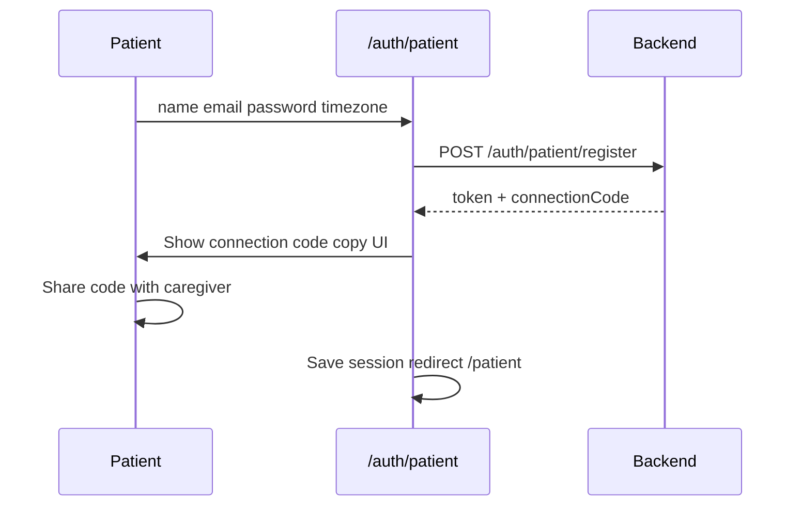
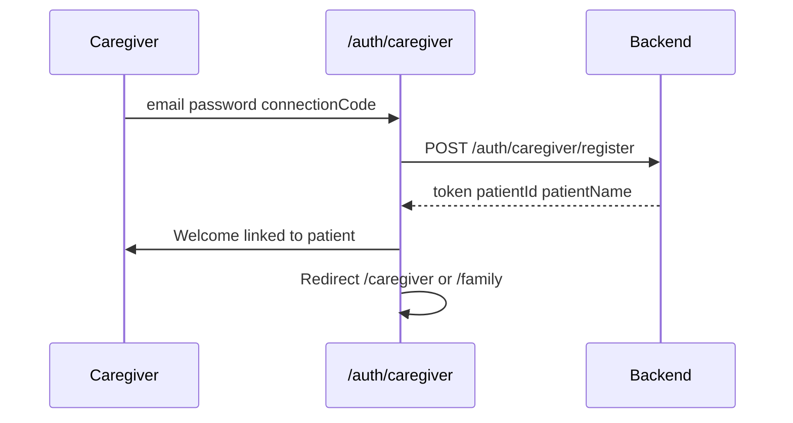

# User Journeys

Screen-level flows for Memodi. Routes marked **(not built)** are implementation targets.

## 1. Patient onboarding

**Register fields:** email, password, name, timezone (required). DOB and preferences optional / profile later.

**Not shown at signup:** preferences editor (server defaults apply).

## 2. Caregiver onboarding

**Rules:**

- Connection code **required** at signup — patient must exist first
- **One caregiver** per patient in v1
- No “register now, link later” flow

## 3. Daily companion use (patient)

**Route:** `/patient` **(not built)**

- Tap orb → listen → tap → processing → spoken response
- Distress turns orb pink; caregiver gets alert
- Uses session `patientId` only

## 4. Memory Bank (caregiver)

**Route:** `/family` **(not built)**  
**Access:** **Caregivers only** — patients cannot open this route

Tabs: People · Objects · Life History · Medications · Events

Uses caregiver JWT’s `patientId` (linked patient).

**Future:** Family-member role may access Memory Bank without caregiver dashboard.

## 5. Caregiver dashboard

**Route:** `/caregiver` **(not built)**

Alerts, interactions, summary stats. Resolve alerts in UI.

## 6. Distress alert

Voice pipeline → DynamoDB alert → SNS → caregiver checks dashboard.

## 7. Proactive routine

EventBridge every 15 min; matches `routine.schedule` to patient timezone. Logged as interactions; patient playback UI optional later.

## Navigation by role

| Role | Tabs (`TabNav.jsx`) |
|------|---------------------|
| Patient | Companion (`/patient`) |
| Caregiver | Memory Bank (`/family`), Dashboard (`/caregiver`) |

Middleware should block wrong-role access (e.g. patient → `/family` → redirect).

## Related docs

- [product-vision.md](product-vision.md)
- [../architecture/auth-and-sessions.md](../architecture/auth-and-sessions.md)
